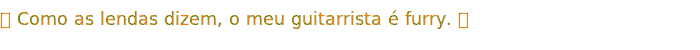

# README.md i guess

## About

> "meu guitarrista é furry" - someone, 2024

idk

[wip website](https://fishlandicfishy.github.io)

## Not even remotely ok at
* HTML
* Lua
  * Luau (Roblox)
* Python
* JavaScript
  * TypeScript
## Languages
* English (preferred)
* Chinese
  * (Traditional Chinese preferred)
  * Mandarin/Putonghua
  * Cantonese (native)
* Portuguese\*
  * (Brazilian Portuguese preferred)
* toki pona\*
## Pronouns
> "Pronouns? They're going woke. They're going woke." - someone, 2024
* he/him (preferred)
* they/them (ok)
<!---
FishlandicFishy/FishlandicFishy is a ✨ special ✨ repository because its `README.md` (this file) appears on your GitHub profile.
You can click the Preview link to take a look at your changes.
--->

## :octocat:
